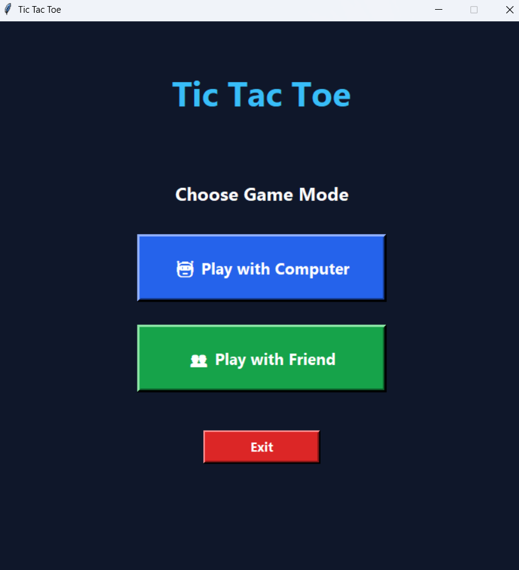
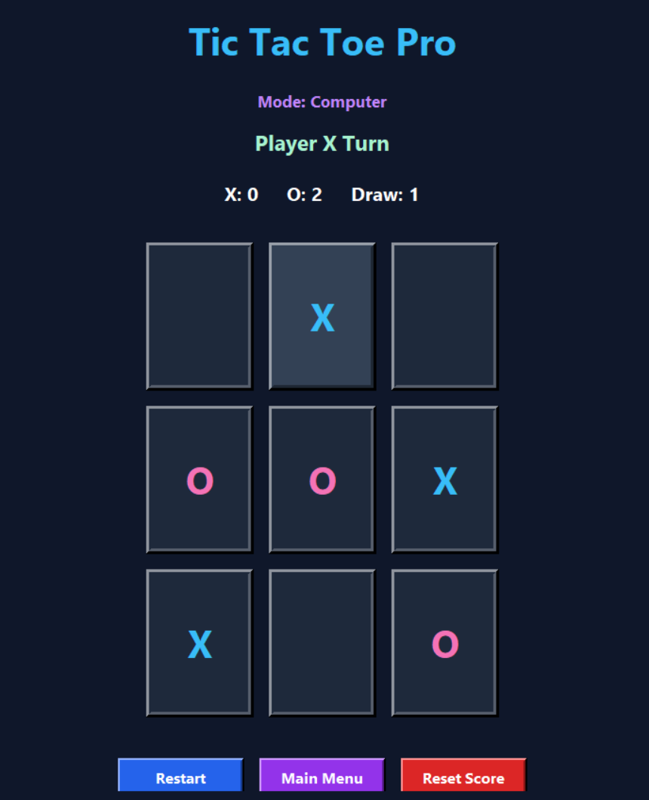
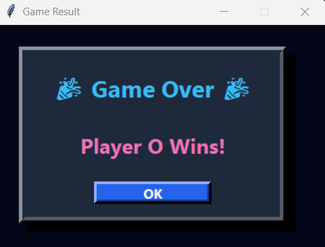

# 🎮 Tic Tac Toe Pro

A modern Tic Tac Toe desktop game built using Python and Tkinter with advanced UI and AI gameplay.

---

## ✨ Features

- 🤖 Play vs Computer
- 👥 Play vs Friend
- 🎨 Modern Dark UI
- 🏆 Scoreboard System
- ✨ Hover Effects
- 🎉 Custom 3D Winner Popup
- 🔄 Restart Match
- 🧠 Smart AI Logic

---

## 📸 Screenshots

### 🔹 Start Page



---

### 🔹 Game Board



---

### 🔹 Winner Popup



---

## 🛠 Technologies Used

- Python
- Tkinter
- OOP Concepts

---

## 🧠 Game Logic

- The game board has 9 boxes arranged in a 3x3 grid.
- Player X always starts the game.
- Players take turns by clicking empty boxes.
- The game checks winning combinations after every move.
- A player wins by matching 3 symbols in a row, column, or diagonal.
- If all boxes are filled and no one wins, the game ends as a draw.
- In Computer Mode, the computer first tries to win, then blocks the player, then selects the center or a random box.

---

## 🎮 Buttons Used

- **Play with Computer** - Start game against AI.
- **Play with Friend** - Start two-player mode.
- **Restart** - Restart current match.
- **Main Menu** - Go back to mode selection screen.
- **Reset Score** - Clear all scores.
- **OK** - Close winner popup.
- **Exit** - Close the application.

---

## 🚀 Run Project

```bash
python main.py
```

---
